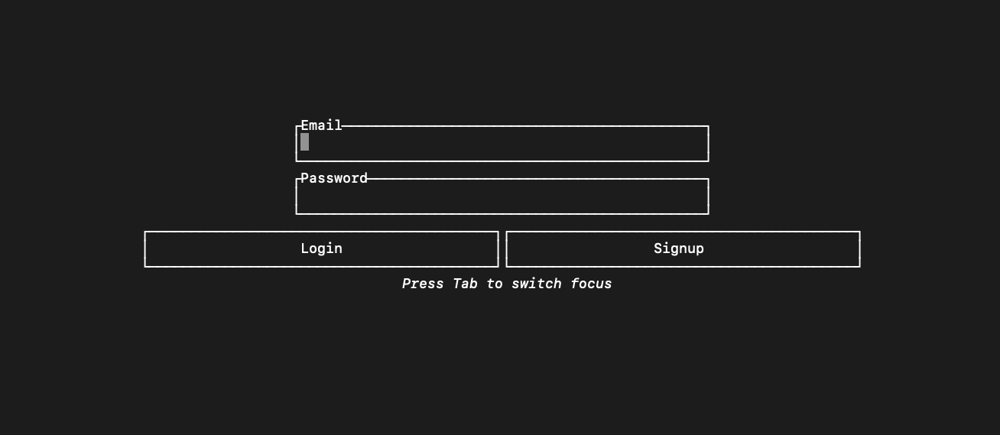
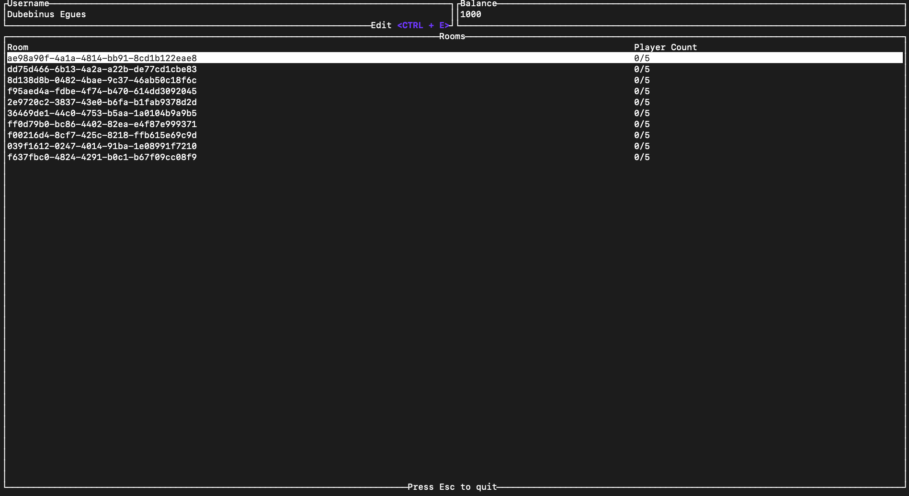
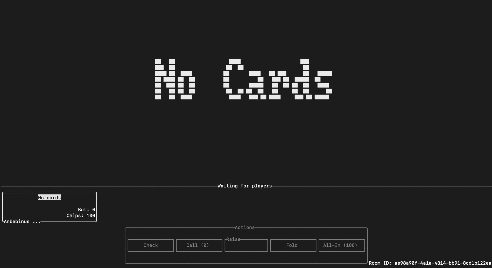

# ♠️ Poker TUI – Multiplayer Texas Hold 'Em in the Terminal

A real-time multiplayer **Texas Hold 'Em** poker game built in Rust with a clean, responsive Terminal User Interface (TUI). Challenge your friends right from your terminal window.

## 🎮 Features

- ♠️ Texas Hold 'Em poker rules
- 🔁 Real-time multiplayer support
- 🖥️ Terminal User Interface (TUI) – no GUI required
- 🕹️ Intuitive keyboard controls
- 📡 Built on top of a custom networking backend in Rust

## 🚀 Installation

Make sure you have [Rust](https://www.rust-lang.org/tools/install) installed.

Then, install the game with:

```bash
cargo install --git https://www.github.com/yewjung/poker-rust ui
```
then, run the command below to start the game:

```bash
ui
```

## Screenshots

  
