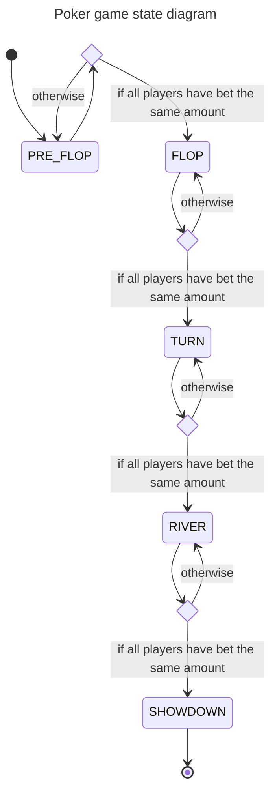

```mermaid
---
title: Poker game state diagram
---
stateDiagram-v2
    state pre_flop_betting_done <<choice>>
    state flop_betting_done <<choice>>
    state turn_betting_done <<choice>>
    state river_betting_done <<choice>>
    [*] --> PRE_FLOP
    PRE_FLOP --> pre_flop_betting_done
    pre_flop_betting_done --> FLOP: if all players have bet the same amount
    pre_flop_betting_done --> PRE_FLOP: otherwise
    FLOP --> flop_betting_done
    flop_betting_done --> TURN: if all players have bet the same amount
    flop_betting_done --> FLOP: otherwise
    TURN --> turn_betting_done
    turn_betting_done --> RIVER: if all players have bet the same amount
    turn_betting_done --> TURN: otherwise
    RIVER --> river_betting_done
    river_betting_done --> SHOWDOWN: if all players have bet the same amount
    river_betting_done --> RIVER: otherwise
    SHOWDOWN --> [*]
```